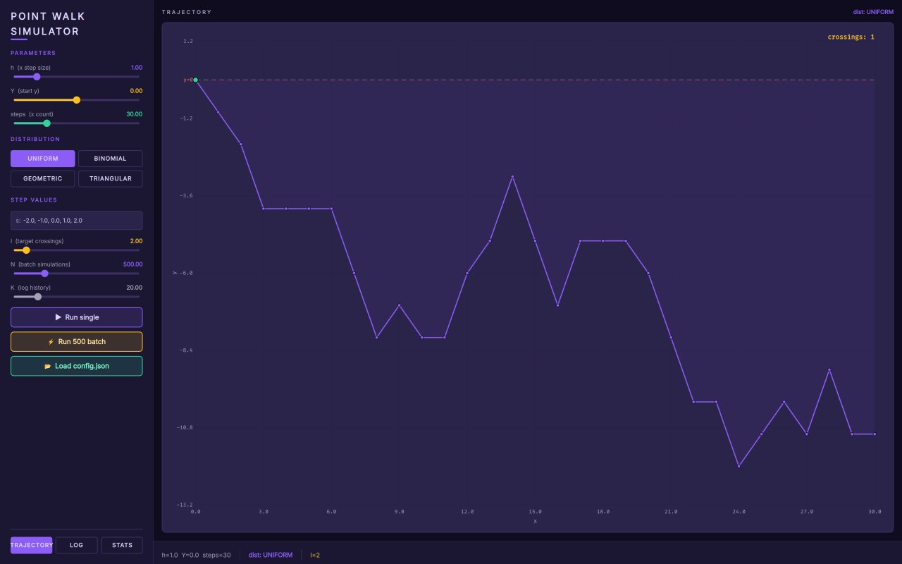
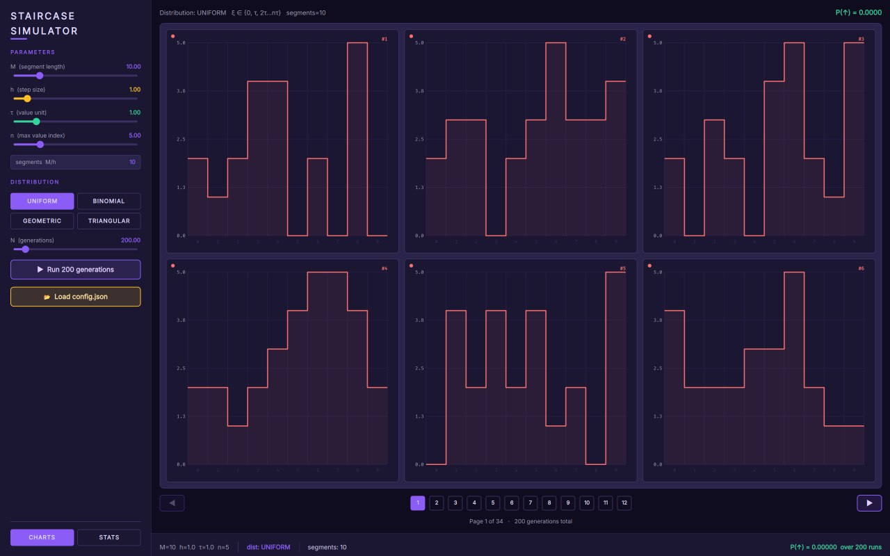
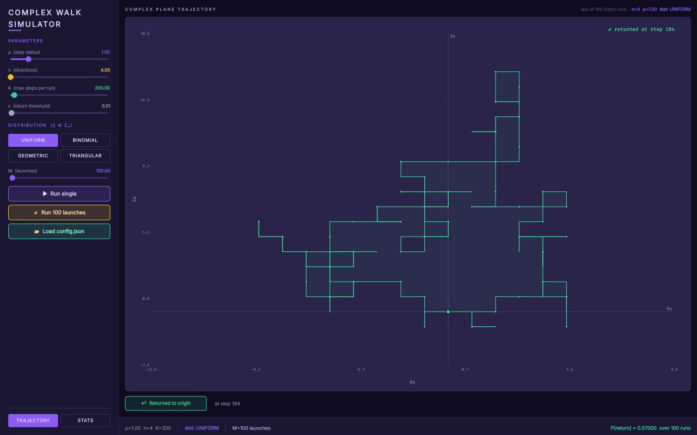
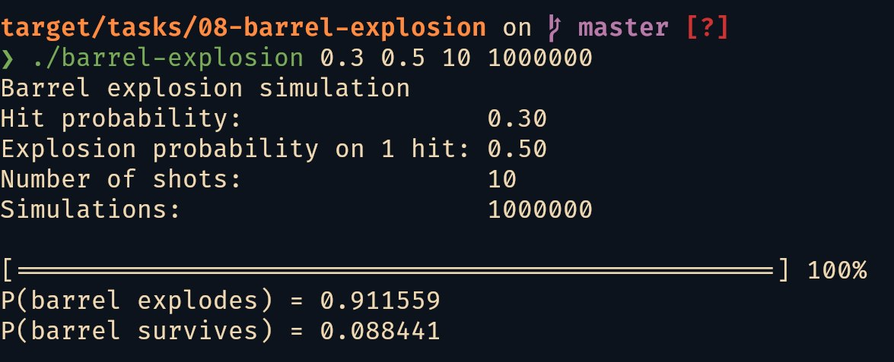
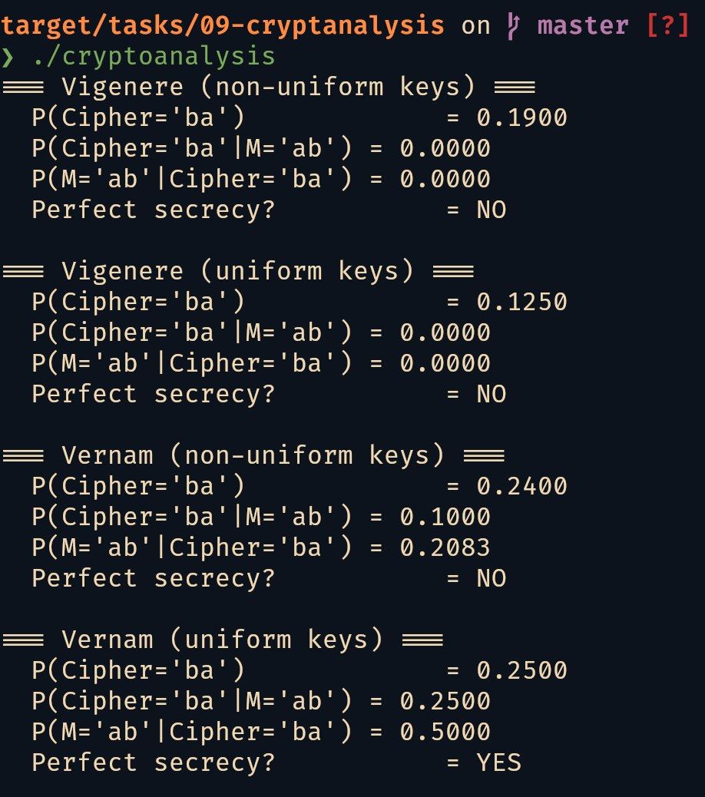
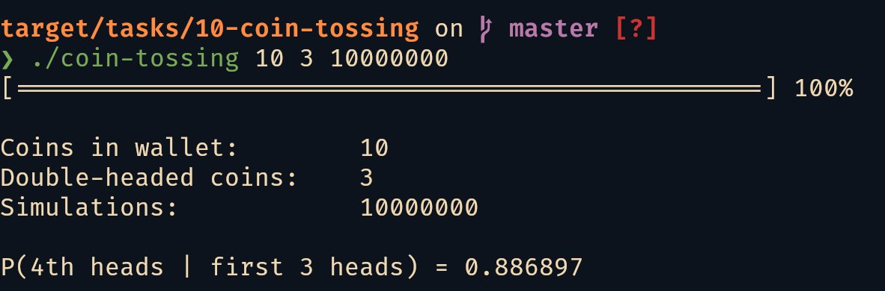
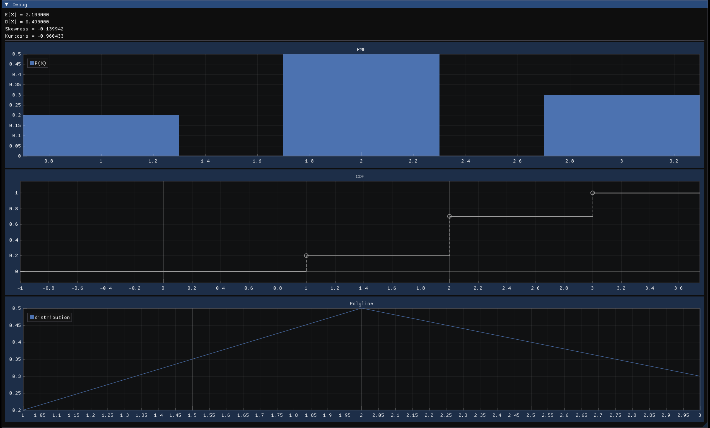
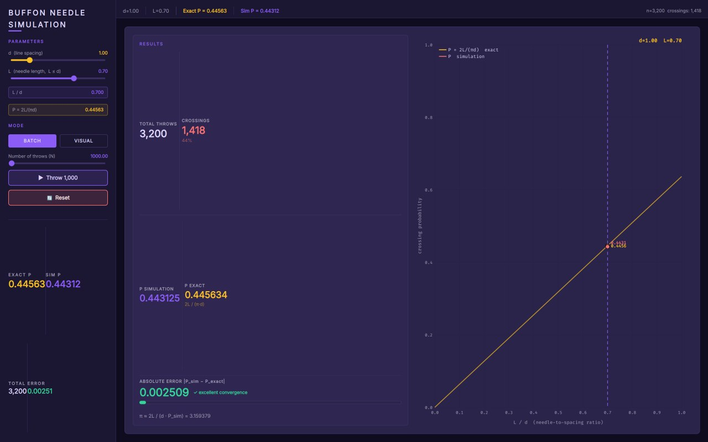
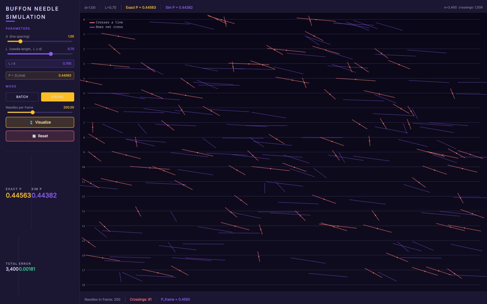
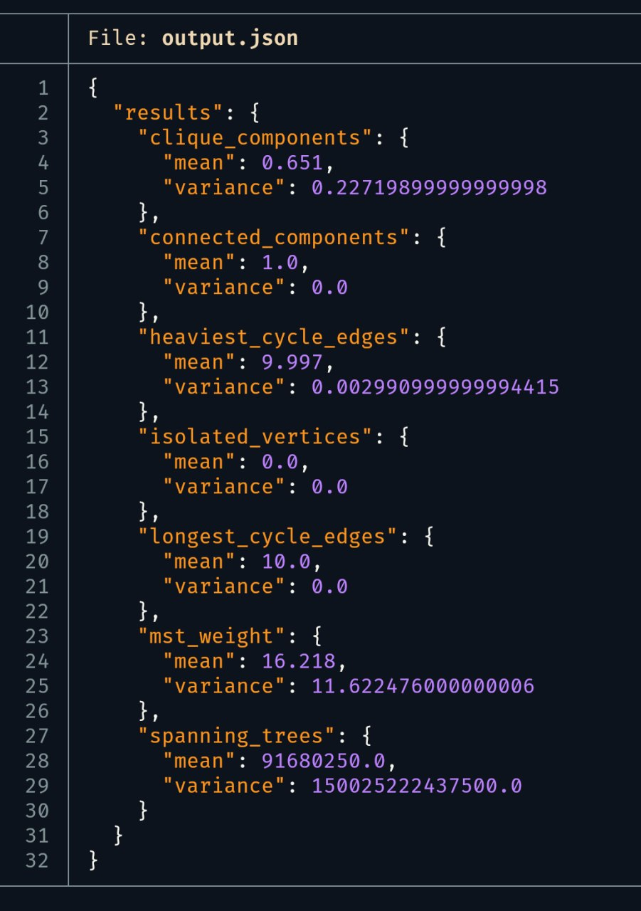

#+TITLE: Создание приложений вероятностного моделирования
#+AUTHOR: Фриев Д.С.
#+DATE: 2026
#+LATEX_COMPILER: xelatex
#+OPTIONS: toc:nil title:nil
#+LATEX_HEADER: \usepackage{fontspec}
#+LATEX_HEADER: \usepackage{amsmath}
#+LATEX_HEADER: \usepackage{amssymb}
#+LATEX_HEADER: \usepackage{amsfonts}
#+LATEX_HEADER: \usepackage{geometry}
#+LATEX_HEADER: \geometry{left=20mm, right=15mm, top=15mm, bottom=15mm}
#+LATEX_HEADER: \setmainfont{Times New Roman}
#+LATEX_HEADER: \setsansfont{Times New Roman}
#+LATEX_HEADER: \setmonofont{"Consolas-with-Yahei"}
#+LATEX_HEADER: \newfontfamily\codefont{"Consolas-with-Yahei"}[Scale=0.88]
#+LATEX_HEADER: \usepackage{seqsplit}
#+LATEX_HEADER: \renewcommand{\texttt}[1]{{\codefont \seqsplit{#1}}}
#+LATEX_HEADER: \newfontfamily\cyrillicfont{Times New Roman}[Script=Cyrillic]
#+LATEX_HEADER: \newfontfamily\cyrillicfontsf{Times New Roman}[Script=Cyrillic]
#+LATEX_HEADER: \newfontfamily\cyrillicfonttt{"Consolas-with-Yahei"}[Script=Cyrillic]
#+LATEX_HEADER: \usepackage{setspace}
#+LATEX_HEADER: \setstretch{1.15}
#+LATEX_HEADER: \usepackage{titlesec}
#+LATEX_HEADER: \titleformat{\section}{\fontsize{16}{24}\selectfont\bfseries\raggedright}{}{0em}{}
#+LATEX_HEADER: \titleformat{\subsection}{\fontsize{16}{24}\selectfont\bfseries\raggedright}{}{0em}{}
#+LATEX_HEADER: \titleformat{\subsubsection}{\fontsize{16}{24}\selectfont\bfseries\raggedright}{}{0em}{}
#+LATEX_HEADER: \titlespacing*{\section}{0pt}{24pt}{12pt}
#+LATEX_HEADER: \titlespacing*{\subsection}{0pt}{18pt}{6pt}
#+LATEX_HEADER: \titlespacing*{\subsubsection}{0pt}{12pt}{6pt}
#+LATEX_HEADER: \usepackage[labelsep=period]{caption}
#+LATEX_HEADER: \DeclareCaptionFont{captionfont}{\fontsize{12}{12}\selectfont}
#+LATEX_HEADER: \captionsetup{font=captionfont}
#+LATEX_HEADER: \captionsetup[figure]{name={Рисунок}, labelsep=period, font={captionfont,it}, justification=centering, singlelinecheck=false, skip=6pt}
#+LATEX_HEADER: \captionsetup[table]{name={Таблица}, labelsep=period, font={captionfont,it}, justification=raggedright, singlelinecheck=false, skip=6pt}
#+LATEX_HEADER: \renewcommand{\contentsname}{Содержание}
#+LATEX_HEADER: \renewcommand{\figurename}{Рисунок}
#+LATEX_HEADER: \renewcommand{\tablename}{Таблица}
#+LATEX_HEADER: \usepackage{float}
#+LATEX_HEADER: \usepackage{xcolor}
#+LATEX_HEADER: \usepackage{booktabs}
#+LATEX_HEADER: \usepackage{microtype}
#+LATEX_HEADER: \setlength{\emergencystretch}{3em}
#+LATEX_HEADER: \tolerance=2000
#+LATEX_HEADER: \usepackage{indentfirst}
#+LATEX_HEADER: \setlength{\parindent}{1.25cm}
#+LATEX_HEADER: \setlength{\parskip}{0pt}
#+LATEX_HEADER: \usepackage[newfloat]{minted}
#+LATEX_HEADER: \setminted{fontsize=\fontsize{12}{12}\selectfont, frame=single, tabsize=2, breaklines}
#+LATEX_HEADER: \SetupFloatingEnvironment{listing}{name={Листинг}}
#+LATEX_HEADER: \captionsetup[listing]{name={Листинг}, labelsep=period, font={captionfont,it}, justification=raggedright, singlelinecheck=false}
#+LATEX_HEADER: \date{}
#+LATEX_HEADER: \usepackage{fancyhdr}
#+LATEX_HEADER: \pagestyle{fancy}
#+LATEX_HEADER: \fancyhf{}
#+LATEX_HEADER: \fancyfoot[C]{\thepage}
#+LATEX_HEADER: \renewcommand{\headrulewidth}{0pt}
#+LATEX_HEADER: \hypersetup{colorlinks=true, linkcolor=black, urlcolor=blue, citecolor=black}

#+LATEX: \begin{titlepage}
#+LATEX: \thispagestyle{empty}
#+LATEX: \begin{center}
#+LATEX: {\fontsize{14}{18}\selectfont
#+LATEX: МИНИСТЕРСТВО НАУКИ И ВЫСШЕГО ОБРАЗОВАНИЯ РФ\par
#+LATEX: \vspace{4mm}
#+LATEX: РГУ им.\ А.Н.~Косыгина (Технологии. Дизайн. Искусство)\par
#+LATEX: \vspace{4mm}
#+LATEX: Институт Информационных технологий и цифровой трансформации\par
#+LATEX: \vspace{4mm}
#+LATEX: Кафедра <<Искусственного интеллекта, прикладной математики и программирования>>\par
#+LATEX: }
#+LATEX: \vspace{20mm}
#+LATEX: {\fontsize{16}{24}\selectfont\bfseries Курсовая работа\par}
#+LATEX: \vspace{6mm}
#+LATEX: {\fontsize{16}{24}\selectfont\bfseries по предмету <<Вероятностное моделирование процессов и систем>>\par}
#+LATEX: \vspace{6mm}
#+LATEX: {\fontsize{16}{24}\selectfont\bfseries на тему\par}
#+LATEX: \vspace{4mm}
#+LATEX: {\fontsize{16}{24}\selectfont\bfseries <<Создание приложений вероятностного моделирования>>\par}
#+LATEX: \vspace{30mm}
#+LATEX: \begin{flushleft}
#+LATEX: {\fontsize{14}{18}\selectfont
#+LATEX: \hspace{60mm}Выполнил: студент группы ИТПМ-124\par
#+LATEX: \hspace{60mm}Фриев Д.С.\par
#+LATEX: \vspace{6mm}
#+LATEX: \hspace{60mm}Научный руководитель:\par
#+LATEX: \hspace{60mm}доцент кафедры ИИПМиП\par
#+LATEX: \hspace{60mm}Романенков А.М.\par
#+LATEX: }
#+LATEX: \end{flushleft}
#+LATEX: \vfill
#+LATEX: {\fontsize{14}{18}\selectfont Москва --- 2026\par}
#+LATEX: \end{center}
#+LATEX: \end{titlepage}

#+LATEX: \tableofcontents
#+LATEX: \clearpage

* Введение

** Цель и задачи

Цель работы --- программная реализация комплекса задач вероятностного моделирования. Для достижения цели необходимо решить следующие задачи:

- разработать математические модели для каждого задания;
- продумать и создать архитектуру приложений;
- реализовать пользовательский интерфейс для управления параметрами моделирования;
- провести численные эксперименты и сравнить эмпирические результаты с теоретическими.

** Используемые технологии

Программная реализация выполнена на языке =C++= стандарта =C++23= с использованием следующих библиотек и инструментов:

- =CMake= ([[https://github.com/Kitware/CMake]]) --- система сборки проекта;
- =Qt6 Quick= ([[https://github.com/qt/qtdeclarative]]) --- фреймворк для разработки графического интерфейса;
- =GLFW= ([[https://github.com/glfw/glfw]]) --- создание окна и контекста OpenGL;
- =Dear ImGui= ([[https://github.com/ocornut/imgui]]) --- графический интерфейс;
- =ImPlot= ([[https://github.com/epezent/implot]]) --- визуализация графиков;
- =nlohmann::json= ([[https://github.com/nlohmann/json]]) --- парсинг конфигурационных файлов;

Все разработанные приложения устойчивы к аварийным завершениям, предусмотрена обработка ошибок ввода-вывода и некорректных параметров.

** Структура пояснительной записки

Документ имеет следующую структуру:

- введение;
- теоретические основы вероятностного моделирования;
- описание задач с подробностями их реализации;
- список использованных источников;
- приложение со ссылкой на репозиторий исходного кода.

#+LATEX: \clearpage

* Теоретическая часть

** Законы распределения случайных величин

Во всех задачах работы моделирование основано на генерации значений случайных величин с заданными законами распределения. Ниже приведены распределения, используемые в программной реализации.

*Дискретное равномерное распределение.*

$$P(X = x_i) = \frac{1}{n}, \quad i = 1, \ldots, n$$

Случайная величина принимает $n$ значений с равными вероятностями. Применяется для равновероятного выбора элементов из конечного множества: выбор символа из алфавита (задача\nbsp{}1), выбор направления блуждания (задачи\nbsp{}4,\nbsp{}6,\nbsp{}7), выбор монеты (задача\nbsp{}10), равномерное распределение положения и угла иглы (задача\nbsp{}12).

*Схема Бернулли и биномиальное распределение.*

$$P(X = k) = \binom{n}{k} p^{k} (1-p)^{n-k}, \quad k = 0, \ldots, n$$

Биномиальное распределение моделирует число успехов в $n$ независимых испытаниях Бернулли с вероятностью успеха $p$. Используется в задаче\nbsp{}8 (число попаданий при обстреле бочки) и как один из законов распределения шага блуждания в задачах\nbsp{}4,\nbsp{}6,\nbsp{}7. Частный случай $n = 1$ --- распределение Бернулли --- применяется в задачах\nbsp{}2,\nbsp{}8,\nbsp{}10 для моделирования бинарных случайных событий (заражение, попадание, орёл).

*Усечённое геометрическое распределение.*

$$P(X = k) = \frac{p(1-p)^k}{\sum_{i=0}^{n-1} p(1-p)^i}, \quad k = 0, \ldots, n-1$$

Геометрическое распределение описывает число неудач до первого успеха. В работе используется его усечённая версия для генерации значений шага блуждания с убывающей вероятностью в задачах\nbsp{}4,\nbsp{}6,\nbsp{}7.

*Дискретное треугольное распределение.*

$$P(X = x_k) \propto \begin{cases} \dfrac{2(x_k - a)}{(c-a)(b-a)}, & a \le x_k \le b, \\[6pt] \dfrac{2(c - x_k)}{(c-a)(c-b)}, & b \le x_k \le c \end{cases}$$

Треугольное распределение применяется в задачах\nbsp{}4,\nbsp{}6,\nbsp{}7 как один из законов для генерации шага или направления. Непрерывное треугольное распределение $\operatorname{Tri}(a,b,c)$ дискретизируется округлением до ближайшего допустимого значения.

*Непрерывное равномерное распределение.*

$$f(x) = \frac{1}{b-a}, \quad x \in [a, b]$$

Непрерывное равномерное распределение задаётся плотностью вероятности, постоянной на отрезке $[a, b]$. Величина $U \sim U(0,1)$ является базовой для генерации всех остальных распределений, поскольку любое преобразование случайной величины $U$ даёт новую случайную величину с заданным законом. В работе $U(0,1)$ используется в задаче\nbsp{}5 для генерации символов кластера по заданному распределению на алфавите.

** Метод Монте-Карло и закон больших чисел

Метод Монте-Карло --- численный метод, основанный на многократной реализации случайного процесса с последующим усреднением.
Пусть $\nu_n$ --- число появлений события $A$ в $n$ независимых испытаниях, и $p = P(A)$ --- теоретическая вероятность. Согласно *теореме Бернулли*, для любого $\varepsilon > 0$:

$$\lim_{n \to \infty} P\!\left( \left| \frac{\nu_n}{n} - p \right| < \varepsilon \right) = 1$$

Относительная частота $\hat{p}_n = \nu_n / n$ сходится по вероятности к $p$ при росте числа испытаний. Это фундаментальное утверждение оправдывает применение метода Монте-Карло: чем больше экспериментов проведено, тем точнее эмпирическая оценка.

#+LATEX: \clearpage

* Практическая часть

** Задача 1. Выбор символа из алфавита

Из упорядоченного алфавита, содержащего $N$ различных символов, последовательно выбирают два символа: сначала один, затем --- один из оставшихся. Все исходы считаются равновероятными. Требуется определить вероятность того, что в первый раз, во второй раз и оба раза будет выбран символ с чётным номером. Индексация элементов алфавита начинается с $1$. Рассматриваются два варианта нумерации после первой выборки: а) индексы оставшихся элементов не изменяются; б) индексы изменяются (переиндексируются начиная с $1$).

*** Аналитическое решение

Пусть алфавит содержит $N$ символов с номерами от $1$ до $N$. Число чётных номеров равно $\lfloor N/2 \rfloor$. Первый символ выбирается равновероятно из всех $N$ элементов.

*Случай а) --- фиксированные индексы.*

$$P(\text{первый чётный}) = \frac{\lfloor N/2 \rfloor}{N}$$

При фиксированных индексах после удаления первого элемента оставшиеся $N-1$ символов сохраняют свои номера. Вероятность того, что второй выбранный символ имеет чётный номер, зависит от чётности первого:

$$P(\text{второй чётный}) = \frac{\lfloor N/2 \rfloor}{N} \cdot \frac{\lfloor N/2 \rfloor - 1}{N-1} + \frac{\lceil N/2 \rceil}{N} \cdot \frac{\lfloor N/2 \rfloor}{N-1}$$

$$P(\text{оба чётных}) = \frac{\lfloor N/2 \rfloor}{N} \cdot \frac{\lfloor N/2 \rfloor - 1}{N - 1}$$

*Случай б) --- переиндексация после первой выборки.*

После удаления первого элемента оставшиеся $N-1$ символов получают новые порядковые номера от $1$ до $N-1$. Число чётных позиций среди $N-1$ элементов равно $\lfloor (N-1)/2 \rfloor$.

$$P(\text{первый чётный}) = \frac{\lfloor N/2 \rfloor}{N}$$

$$P(\text{второй чётный}) = \frac{\lfloor (N-1)/2 \rfloor}{N-1}$$

$$P(\text{оба чётных}) = \frac{\lfloor N/2 \rfloor}{N} \cdot \frac{\lfloor (N-1)/2 \rfloor}{N-1}$$

*** Эмпирическая проверка

Программа принимает два параметра командной строки: мощность алфавита $N$ и количество экспериментов $C$. Для генерации случайных чисел используется Вихрь Мерсенна (=std::mt19937=). Запуск серии экспериментов выполняется через вспомогательный класс =TaskRunner=.

#+CAPTION: Эксперимент с фиксированными индексами
#+BEGIN_SRC cpp
auto experiment_fixed_indices = [alphabet_size](auto& rng) {
    std::uniform_int_distribution<size_t> dist1(1, alphabet_size);
    size_t first = dist1(rng);

    std::vector<size_t> remaining;
    remaining.reserve(alphabet_size - 1);
    for (size_t i = 1; i <= alphabet_size; i++) {
        if (i != first) remaining.push_back(i);
    }

    std::uniform_int_distribution<size_t> dist2(0, remaining.size() - 1);
    size_t second = remaining[dist2(rng)];

    return Outcome{first % 2 == 0, second % 2 == 0};
};
#+END_SRC

#+CAPTION: Эксперимент с переиндексацией после первого выбора
#+BEGIN_SRC cpp
auto experiment_reindexed = [alphabet_size](auto& rng) {
    std::vector<size_t> indices(alphabet_size);
    std::iota(indices.begin(), indices.end(), 1);

    std::uniform_int_distribution<size_t> dist1(0, indices.size() - 1);
    size_t first_pos = dist1(rng);
    bool first_even = (first_pos + 1) % 2 == 0;

    indices.erase(indices.begin() + first_pos);

    std::uniform_int_distribution<size_t> dist2(0, indices.size() - 1);
    size_t second_pos = dist2(rng);
    bool second_even = (second_pos + 1) % 2 == 0;

    return Outcome{first_even, second_even};
};
#+END_SRC

Вычислительный эксперимент проведён при $N = 100$, $C = 10^8$.

#+CAPTION: Результаты эксперимента при $N = 100$, $C = 10^8$
#+ATTR_LATEX: :width 0.9\textwidth :placement [H]
[[file:assets/task01.png]]

Полученные эмпирические вероятности:

#+ATTR_LATEX: :width 0.9\textwidth
#+CAPTION: Результаты эксперимента при $N = 100$, $C = 10^8$
| Вариант нумерации     | Первый чётный | Второй чётный | Оба чётных |
|-----------------------+---------------+---------------+------------|
| Фиксированные индексы |     0.499913  |     0.500032  |  0.247482  |
| Переиндексация        |     0.499995  |     0.494859  |  0.247438  |

Теоретические значения при $N = 100$:

$$P_{\text{first}} = \frac{50}{100} = 0.5$$
$$P_{\text{second}}^{(a)} = 0.5$$
$$P_{\text{second}}^{(b)} = \frac{49}{99} \approx 0.494949$$
$$P_{\text{both}} = \frac{50}{100} \cdot \frac{49}{99} \approx 0.247475$$

Сравнение показывает высокую точность моделирования. Максимальное абсолютное отклонение составляет $8.7 \times 10^{-5}$ для случая фиксированных индексов и $9.0 \times 10^{-5}$ для случая переиндексации.

#+LATEX: \clearpage

** Задача 2. Моделирование эпидемии на графе социальных контактов

Требуется реализовать стохастическую модель распространения инфекции контактным путём на неориентированном графе знакомств. Для каждого контакта «здоровый---инфицированный» заражение происходит с вероятностью $p_1 \in (0; 1]$. Инфицированный выздоравливает на каждом шаге с вероятностью $p_2 \in [0; 1]$.

*** Модель и структуры данных

Граф контактов хранится в виде списка смежности. Состояния образуют конечный автомат: Healthy $\to$ Infected (с вероятностью $p_1$ при контакте), Infected $\to$ Recovered (с вероятностью $p_2$ на каждом шаге). Состояние Recovered --- поглощающее.

#+CAPTION: Структура вершины и состояния эпидемиологической модели
#+BEGIN_SRC cpp
enum class PersonState { Healthy, Infected, Recovered };

struct Person {
  int id;
  PersonState state = PersonState::Healthy;
  std::vector<int> contacts;
};
#+END_SRC

*** Ядро симуляции

#+CAPTION: Метод step() --- ядро симуляции
#+BEGIN_SRC cpp
const std::vector<Person>& Simulation::step() {
    if (m_current_step == 0) {
        std::uniform_int_distribution<size_t> pick(0, m_people.size() - 1);
        m_people[pick(m_rng)].state = PersonState::Infected;
        m_current_step++;
        return m_people;
    }

    std::vector<int> newly_infected;
    for (const auto& person : m_people) {
        if (person.state != PersonState::Infected) continue;
        for (int cid : person.contacts) {
            if ((m_people[cid].state == PersonState::Recovered ||
                 m_people[cid].state == PersonState::Healthy) &&
                m_dist(m_rng) < p_infect)
                newly_infected.push_back(cid);
        }
    }
    for (int id : newly_infected)
        m_people[id].state = PersonState::Infected;

    for (auto& person : m_people)
        if (person.state == PersonState::Infected &&
            m_dist(m_rng) < p_recover)
            person.state = PersonState::Recovered;

    m_current_step++;
    return m_people;
}
#+END_SRC

*** Аналитические запросы к результатам

Реализованы четыре поисковых запроса, выполняемых за один проход по массиву вершин:

- *Все не заразившиеся* --- вершины в состоянии Healthy.
- *Все исцелившиеся* --- вершины в состоянии Recovered.
- *Исцелившиеся, чьё окружение не исцелилось* --- Recovered-вершины, среди соседей которых есть не-Recovered.
- *Не заразившиеся, чьё окружение полностью заражено* --- Healthy-вершины, у которых все соседи Infected.

#+CAPTION: Поиск исцелившихся с неисцелившимся окружением
#+BEGIN_SRC cpp
std::vector<int> Simulation::recovered_with_sick_contacts() const {
    std::vector<int> r;
    for (const auto& p : m_people) {
        if (p.state != PersonState::Recovered) continue;
        for (int cid : p.contacts) {
            if (m_people[cid].state != PersonState::Recovered) {
                r.push_back(p.id);
                break;
            }
        }
    }
    return r;
}
#+END_SRC

*** Тестовые данные и визуализация

Тестовый граф --- датасет Facebook-страниц категории «Artist» из коллекции GEMSEC. Параметры моделирования: $p_1 = 0.3$, $p_2 = 0.1$. Визуализация графа реализована на QML с использованием =Canvas=. Для работы с большими графами строится BFS-подграф от вершины с максимальной степенью. Размещение вершин --- force-based алгоритм.

Отрисовка дифференцирует состояния вершин цветом: зелёный --- Healthy, красный --- Infected, синий --- Recovered.

#+CAPTION: Интерфейс приложения
#+ATTR_LATEX: :width 0.8\textwidth :placement [H]
[[file:assets/task02_gui.png]]

#+CAPTION: Пример аналитического запроса
#+ATTR_LATEX: :width 0.8\textwidth :placement [H]
[[file:assets/task02_search.png]]

#+LATEX: \clearpage

** Задача 3. Распространение слухов

В городе проживает $n+1$ человек. Один из них узнаёт новость и передаёт её другому, тот --- следующему, и так далее. На каждом шаге каждый знающий новость выбирает $N$ случайных адресатов из $n$ остальных жителей и сообщает новость им. Требуется определить вероятность того, что новость будет передана $r$ раз без: а) возвращения к первому узнавшему (режим =ReturnToSender=); б) повторного сообщения кому-либо (режим =RepeatedMessage=).

*** Модель и алгоритм

Процесс моделируется на полном графе из $n+1$ вершин. Вершина $0$ --- источник. Состояние системы --- булев массив =knows= размера $n+1$, изначально =knows[0] = true=.

*** Ядро симуляции

#+CAPTION: Метод run() --- выполнение одного эксперимента
#+BEGIN_SRC cpp
std::pair<bool, std::vector<Simulation::GraphNode>>
Simulation::run(size_t r, int seed) {
  m_rng = std::mt19937(seed);
  std::uniform_int_distribution<int> dist(0, m_n);
  std::vector<bool> knows(m_n + 1, false);
  knows[0] = true;
  std::vector<GraphNode> graph;

  for (size_t step = 0; step < r; ++step) {
    std::vector<size_t> knowers;
    for (size_t i = 0; i <= m_n; ++i)
      if (knows[i]) knowers.push_back(i);

    for (size_t sender : knowers) {
      for (size_t j = 0; j < m_N; ++j) {
        int target;
        do { target = dist(m_rng); }
        while (static_cast<size_t>(target) == sender);

        if (m_mode == Mode::ReturnToSender) {
          if (target == 0) {
            graph.push_back({sender, 0, step});
            return {false, graph};
          }
        } else {
          if (knows[static_cast<size_t>(target)]) {
            graph.push_back({sender,
                static_cast<size_t>(target), step});
            return {false, graph};
          }
        }
        graph.push_back({sender,
            static_cast<size_t>(target), step});
        knows[static_cast<size_t>(target)] = true;
      }
    }
  }
  return {true, graph};
}
#+END_SRC

*** Визуализация и результаты

Интерфейс позволяет настраивать $n$, $r$, $N$, $K$, выбирать режим и запускать моделирование в пошаговом или быстром пакетном режиме.

#+CAPTION: Интерфейс приложения: настройка параметров, статистика, граф передачи
#+ATTR_LATEX: :width 0.65\textwidth :placement [H]
[[file:assets/task03_gui.png]]

#+CAPTION: Граф успешного эксперимента
#+ATTR_LATEX: :width 0.65\textwidth :placement [H]
[[file:assets/task03_success.png]]

#+CAPTION: Граф неудачного эксперимента
#+ATTR_LATEX: :width 0.65\textwidth :placement [H]
[[file:assets/task03_failure.png]]

#+LATEX: \clearpage

** Задача 4. Моделирование движения материальной точки со случайным шагом

На координатной плоскости $xOy$ материальная точка движется с постоянным шагом $h$ по оси абсцисс, стартуя из точки $(0; Y)$. Закон движения по оси ординат определяется случайной величиной $s$, принимающей значения $\{s_1, s_2, \ldots, s_n\}$.

*** Законы распределения случайной величины $s$

Поддерживаются четыре распределения:

- *Равномерное* --- каждое значение $s_j$ выбирается с равной вероятностью $1/n$.
- *Биномиальное* --- индекс $j$ выбирается по биномиальному закону $\operatorname{Bin}(m, p)$.
- *Конечное геометрическое* --- $P(j) \propto (1-p)^{j} p$.
- *Дискретное треугольное* --- $\operatorname{Tri}(a, b, c)$ дискретизируется округлением.

#+CAPTION: Генерация случайного шага
#+BEGIN_SRC cpp
double PointWalkSimulation::sample_step() {
    int n = (int)m_cfg.steps.size() - 1;
    if (n < 0) return 0.0;

    switch (m_cfg.dist) {
    case Distribution::Uniform: {
        std::uniform_int_distribution<int> d(0, n);
        return m_cfg.steps[d(m_rng)];
    }
    case Distribution::Binomial: {
        std::binomial_distribution<int>
            d(m_cfg.binom_trials, m_cfg.binom_p);
        int k = d(m_rng) % (n + 1);
        return m_cfg.steps[k];
    }
    case Distribution::FiniteGeometric: {
        std::vector<double> weights(n + 1);
        double sum = 0.0;
        for (int i = 0; i <= n; i++) {
            weights[i] = std::pow(1.0 - m_cfg.geom_p, i)
                        * m_cfg.geom_p;
            sum += weights[i];
        }
        for (auto& w : weights) w /= sum;
        std::discrete_distribution<int>
            d(weights.begin(), weights.end());
        return m_cfg.steps[d(m_rng)];
    }
    case Distribution::DiscreteTriangular: {
        std::uniform_real_distribution<double> u01(0.0, 1.0);
        double u = u01(m_rng);
        double Fc = (m_cfg.tri_b - m_cfg.tri_a)
                   / (m_cfg.tri_c - m_cfg.tri_a);
        double sample;
        if (u < Fc)
            sample = m_cfg.tri_a
                + std::sqrt(u * (m_cfg.tri_c - m_cfg.tri_a)
                                    * (m_cfg.tri_b - m_cfg.tri_a));
        else
            sample = m_cfg.tri_c
                - std::sqrt((1.0 - u) * (m_cfg.tri_c - m_cfg.tri_a)
                                    * (m_cfg.tri_c - m_cfg.tri_b));
        int best = 0;
        double bestDist = std::abs(m_cfg.steps[0] - sample);
        for (int i = 1; i <= n; i++) {
            double d = std::abs(m_cfg.steps[i] - sample);
            if (d < bestDist) { bestDist = d; best = i; }
        }
        return m_cfg.steps[best];
    }
    }
    return 0.0;
}
#+END_SRC

*** Ядро симуляции

Класс =PointWalkSimulation= инкапсулирует параметры моделирования и генератор псевдослучайных чисел =std::mt19937=.

#+CAPTION: Метод генерации одной траектории
#+BEGIN_SRC cpp
WalkResult PointWalkSimulation::run_single() {
    WalkResult r;
    r.start_y = m_cfg.Y;
    int steps = m_cfg.x_steps;
    r.xs.reserve(steps + 1);
    r.ys.reserve(steps + 1);

    double x = 0.0, y = m_cfg.Y;
    r.xs.push_back(x);
    r.ys.push_back(y);
    for (int i = 0; i < steps; i++) {
        x += m_cfg.h;
        y += sample_step();
        r.xs.push_back(x);
        r.ys.push_back(y);
    }
    r.crossings = count_crossings(r.ys);
    return r;
}
#+END_SRC

#+CAPTION: Подсчёт пересечений оси абсцисс
#+BEGIN_SRC cpp
int PointWalkSimulation::count_crossings(
    const std::vector<double>& ys) {
    int cnt = 0;
    for (size_t i = 1; i < ys.size(); i++) {
        double a = ys[i - 1];
        double b = ys[i];
        if (a == 0.0 && b != 0.0) { cnt++; continue; }
        if (b == 0.0) { cnt++; continue; }
        if ((a > 0.0) != (b > 0.0)) cnt++;
    }
    return cnt;
}
#+END_SRC

*** Конфигурационный файл

Параметры моделирования загружаются из JSON-файла:

#+CAPTION: Пример конфигурационного файла config.json
#+BEGIN_SRC json
{
    "h":              1.5,
    "Y":              0.0,
    "x_steps":        50,
    "K":              20,
    "l":              2,
    "N_simulations":  500,
    "distribution":   "uniform",
    "steps":          [-2.0, -1.0, 0.0, 1.0, 2.0],
    "binomial_trials": 4,
    "binomial_p":      0.5,
    "geometric_p":     0.4,
    "triangular_a":    0.0,
    "triangular_b":    0.5,
    "triangular_c":    1.0
}
#+END_SRC

*** Графический интерфейс

Приложение построено на Qt6 Quick. Интерфейс содержит боковую панель управления и центральную область с графиком траектории.

#+CAPTION: Интерфейс приложения: панель управления и график траектории
#+ATTR_LATEX: :width 0.8\textwidth :placement [H]

#+LATEX: \clearpage

** Задача 5. Кластеры и \(k\)-паттерны

Дана серия из $M$ кластеров, каждый содержит $n$ ячеек. В каждую ячейку помещается символ из алфавита $A$ мощности $r$. Лексема длины $k$ называется \(k\)-паттерном. Два соседних кластера соединяемы по заданному \(k\)-паттерну, если конкатенация некоторого суффикса левого кластера с некоторым префиксом правого кластера в точности даёт этот паттерн.

*** Модель и критерий соединяемости

Кластеры $C_i$ и $C_{i+1}$ соединяемы по паттерну $P$ длины $k$, если существуют натуральные $a$ и $b$ такие, что:

$$a + b = k, \quad 1 \le a \le n-1, \quad 1 \le b \le n-1$$
$$\operatorname{suffix}_a(C_i) \oplus \operatorname{prefix}_b(C_{i+1}) = P$$

*** Алгоритм проверки соединяемости

#+CAPTION: Метод проверки соединяемости двух соседних кластеров
#+BEGIN_SRC cpp
bool ClusterSimulator::are_connected(
    const std::string& left,
    const std::string& right) const {
    for (int a = 1; a < m_cells_per_cluster
              && a < m_pattern_length; ++a) {
        int b = m_pattern_length - a;
        if (b < 1 || b >= m_cells_per_cluster) continue;

        std::string suffix = left.substr(
            m_cells_per_cluster - a, a);
        std::string prefix = right.substr(0, b);

        if (suffix + prefix == m_pattern) return true;
    }
    return false;
}
#+END_SRC

*** Генерация кластеров

Кластеры генерируются побуквенно методом обратного преобразования, согласно заданному распределению вероятностей на алфавите.

#+CAPTION: Генерация одного кластера
#+BEGIN_SRC cpp
std::string ClusterSimulator::generate_cluster() {
    std::string cluster;
    for (int i = 0; i < m_cells_per_cluster; ++i) {
        double r = m_distribution(m_generator);
        for (size_t j = 0; j < m_cumulative.size(); ++j) {
            if (r < m_cumulative[j]) {
                cluster += m_symbols[j];
                break;
            }
        }
    }
    return cluster;
}
#+END_SRC

*** Результаты моделирования

Эксперименты проведены при $M = 10$, $n = 5$, $k = 3$, $A = \{0, 1\}$, $C = 10^6$.

В первом эксперименте с равномерным распределением ($P(0)=P(1)=0.5$) и паттерном $101$ распределение числа соединяемых пар $D$ близко к симметричному с максимумом в точке $D = 3$: $P(D=3) \approx 0.275$, на краях $P(D=0) \approx 0.039$ и $P(D=7) \approx 0.001$ ($P(D=8) \approx 0.000$). Вероятность одновременной соединяемости всех девяти пар составляет $P_{\text{all}} \approx 0.039$.

При смещённом распределении ($P(1) = 0.7$, паттерн $101$) соединяемость резко возрастает: $P_{\text{all}} \approx 0.182$, максимум смещается в область больших $D$ ($P(D=6) \approx 0.290$), а вероятность малых $D$ становится пренебрежимо малой ($P(D=0) \approx 0.001$).

Паттерн $111$ при равномерном распределении практически не даёт соединяемых пар: $P_{\text{all}} \approx 0.000$, а с вероятностью $P(D \le 2) \approx 0.990$ соединяемыми оказываются не более двух пар из рядом стоящих кластеров; значения $D \ge 4$ практически не наблюдаются.

При равномерном распределении и паттерне $101$ распределение $D$ близко к симметричному с максимумом в $D = 3$. При смещённом распределении ($P(1) = 0.7$) вероятность всех соединяемых пар резко возрастает. Паттерн $111$ при равномерном распределении практически не даёт соединяемых пар.

#+LATEX: \clearpage

** Задача 6. Ступенчатая фигура

Дан отрезок $[0; M]$, $M > 0$, разбитый на отрезки длины $h$. На каждом подотрезке определена случайная величина $\xi$, принимающая значения из множества $\{0, \tau, 2\tau, \ldots, n\tau\}$.

*** Математическая модель

$$f(x) = \xi_i, \quad x \in (x_{i-1}, x_i], \quad i = 1, \ldots, N$$

Ступенчатая фигура называется *строго возрастающей лестницей*, если $\xi_1 < \xi_2 < \cdots < \xi_N$.

#+CAPTION: Генерация одного значения $\xi_i$
#+BEGIN_SRC cpp
double StaircaseSimulation::sample_one() {
    int n = m_cfg.n_values;
    double tau = m_cfg.tau;

    switch (m_cfg.dist) {
    case Distribution::Uniform: {
        std::uniform_int_distribution<int> d(0, n);
        return d(m_rng) * tau;
    }
    case Distribution::Binomial: {
        std::binomial_distribution<int>
            d(m_cfg.binom_trials, m_cfg.binom_p);
        int k = d(m_rng);
        return (k % (n + 1)) * tau;
    }
    case Distribution::FiniteGeometric: {
        std::vector<double> weights(n + 1);
        double sum = 0.0;
        for (int i = 0; i <= n; i++) {
            weights[i] = std::pow(1.0 - m_cfg.geom_p, i)
                        * m_cfg.geom_p;
            sum += weights[i];
        }
        for (auto& w : weights) w /= sum;
        std::discrete_distribution<int>
            d(weights.begin(), weights.end());
        return d(m_rng) * tau;
    }
    case Distribution::DiscreteTriangular: {
        // ... обратное преобразование
        return best * tau;
    }
    }
    return 0.0;
}
#+END_SRC

#+CAPTION: Проверка строгой возрастаемости
#+BEGIN_SRC cpp
bool StaircaseSimulation::check_strictly_increasing(
    const std::vector<double>& v) {
    for (size_t i = 1; i < v.size(); i++)
        if (v[i] <= v[i - 1]) return false;
    return !v.empty();
}
#+END_SRC

*** Графический интерфейс

Приложение построено на Qt6 Quick. Боковая панель содержит настройки параметров и область статистики. Сгенерированные ступенчатые фигуры отображаются на сетке по 6 штук на страницу с пагинацией.

#+CAPTION: Интерфейс приложения: панель управления, статистика и сетка фигур
#+ATTR_LATEX: :width 0.8\textwidth :placement [H]

#+LATEX: \clearpage

** Задача 7. Комплексная плоскость и случайные блуждания с фиксированным шагом

Рассматривается случайное блуждание на комплексной плоскости с фиксированной длиной шага. Направление каждого шага выбирается из конечного набора равноотстоящих углов.

*** Математическая модель

$$\begin{cases} x_k = x_{k-1} + \rho \cos\!\big(\frac{2\pi}{n}\xi_k\big) \\[4pt] y_k = y_{k-1} + \rho \sin\!\big(\frac{2\pi}{n}\xi_k\big) \end{cases} \qquad (x_0, y_0) = (0, 0)$$

Поддерживаются четыре закона распределения индекса $\xi_k$: равномерное, биномиальное, усечённое геометрическое и дискретное треугольное.

Блуждание считается вернувшимся в начало координат, если $\|z_k\| = \sqrt{x_k^2 + y_k^2} < \varepsilon$.

*** Ядро симуляции

#+CAPTION: Метод симуляции одного блуждания
#+BEGIN_SRC cpp
WalkResult ComplexWalkSimulation::run_single() {
    WalkResult r;
    r.path.push_back({0.0, 0.0});
    for (int step = 1; step <= m_cfg.K; step++) {
        int xi = sample_xi();
        double dx = m_cfg.rho
            * std::cos(2.0 * M_PI / m_cfg.n * xi);
        double dy = m_cfg.rho
            * std::sin(2.0 * M_PI / m_cfg.n * xi);
        Point2D pt{r.path.back().x + dx,
                   r.path.back().y + dy};
        r.path.push_back(pt);
        if (std::hypot(pt.x, pt.y) < m_cfg.epsilon) {
            r.returned = true;
            r.return_step = step;
            return r;
        }
    }
    r.returned = false;
    r.return_step = -1;
    return r;
}
#+END_SRC

#+RESULTS:

#+CAPTION: Генерация индекса направления для треугольного распределения
#+BEGIN_SRC cpp
int ComplexWalkSimulation::sample_xi_triangular() {
    double u = std::uniform_real_distribution<double>(
        0.0, 1.0)(m_rng);
    double fc = (m_cfg.tri_c - m_cfg.tri_a);
    double fb = (m_cfg.tri_b - m_cfg.tri_a) / fc;
    double s;
    if (u <= fb) {
        s = m_cfg.tri_a
          + std::sqrt(u * fc * (m_cfg.tri_b - m_cfg.tri_a));
    } else {
        s = m_cfg.tri_c
          - std::sqrt((1.0 - u) * fc
                      * (m_cfg.tri_c - m_cfg.tri_b));
    }
    int idx = static_cast<int>(
        s / fc * (m_cfg.n - 1) + 0.5);
    return std::clamp(idx, 0, m_cfg.n - 1);
}
#+END_SRC

*** Графический интерфейс

Приложение построено на Qt6 Quick. Левая панель содержит органы управления параметрами; правая область отображает траекторию или статистику. Визуализация на комплексной плоскости с координатной сеткой и маркерами начала/конца. Траектории, вернувшиеся в начало, выделяются зелёным цветом.

#+CAPTION: Интерфейс приложения: панель управления и траектория на комплексной плоскости
#+ATTR_LATEX: :width 0.8\textwidth :placement [H]

#+LATEX: \clearpage

** Задача 8. Моделирование взрыва бочки с бензином

Рассматривается вероятностная модель разрушения бочки с бензином при многократном обстреле. Каждый выстрел независимо поражает цель с заданной вероятностью. Бочка взрывается при двух и более попаданиях; при одном попадании взрыв происходит с дополнительной условной вероятностью.

*** Математическая модель

Производится $n$ независимых выстрелов по бочке. Число попаданий $X$ имеет биномиальное распределение:

$$P(X = k) = \binom{n}{k} p^k (1-p)^{n-k}$$

Бочка взрывается при $X \ge 2$ (гарантированный взрыв) и при $X = 1$ с вероятностью $p_1$.

*** Программная реализация

Задача реализована в виде консольного приложения, использующего шаблонный класс =TaskRunner=.

#+CAPTION: Лямбда-функция одного испытания
#+BEGIN_SRC cpp
auto experiment = [p, p1, n](auto& rng) -> bool {
    std::bernoulli_distribution hit(p);

    int hits = 0;
    for (int i = 0; i < n; i++)
        if (hit(rng)) ++hits;

    if (hits == 0) return false;
    if (hits >= 2) return true;

    return std::bernoulli_distribution(p1)(rng);
};
#+END_SRC

#+CAPTION: Основная функция с разбором аргументов
#+BEGIN_SRC cpp
int main(int argc, char** argv) {
    if (argc != 5) { print_usage(argv[0]); return 1; }

    double p   = std::stod(argv[1]);
    double p1  = std::stod(argv[2]);
    int    n   = std::stoi(argv[3]);
    size_t sim = std::stoull(argv[4]);

    auto experiment = /* ... lambda above ... */;

    TaskRunner runner;
    auto results = runner.run(experiment, sim);

    auto freq = tally(results);
    size_t explosions = freq[true];
    double p_explosion = 1.0 * explosions / sim;

    std::println("P(barrel explodes) = {:.6f}",
                 p_explosion);
    std::println("P(barrel survives) = {:.6f}",
                 1.0 - p_explosion);

    return 0;
}
#+END_SRC

#+CAPTION: Результат моделирования взрыва бочки для $p = 0{,}3$, $p_1 = 0{,}5$, $n = 10$
#+ATTR_LATEX: :width 0.9\textwidth :placement [H]

#+LATEX: \clearpage

** Задача 9. Криптоанализ: совершенная секретность и теорема Шеннона

Рассматривается задача криптоанализа --- оценка совершенной секретности шифров на малом пространстве сообщений и ключей.

*** Математическая модель

Задано конечное пространство сообщений $M = \{m_1, \ldots, m_{|M|}\}$ с априорным распределением $P(m)$ и пространство ключей $K = \{k_1, \ldots, k_{|K|}\}$ с распределением $P(k)$. Шифрование выполняется детерминированной функцией $c = E(m, k)$.

Рассматриваются два алгоритма шифрования:

$$c_i = (m_i + k_{i \bmod |k|}) \bmod 26 \quad \text{(Виженер)}$$

$$c_i = (m_i \oplus k_{i \bmod |k|}) \bmod 26 \quad \text{(Вернам)}$$

*Шенноновская совершенная секретность.* Шифр обладает совершенной секретностью, если для всех $m \in M$, $c \in C$:

$$P(M = m | C = c) = P(M = m)$$

*** Программная реализация

Анализ выполняется полным перебором всех пар «сообщение---ключ».

#+CAPTION: Функция анализа
#+BEGIN_SRC cpp
void analyze(
    const std::vector<std::string>& msgs,
    const std::vector<double>& msg_probs,
    const std::vector<std::string>& keys,
    const std::vector<double>& key_probs,
    const std::string& target_cipher,
    const std::string& target_msg,
    bool use_vigenere)
{
    double p_cipher = 0.0;
    for (size_t j = 0; j < msgs.size(); j++)
        for (size_t s = 0; s < keys.size(); s++)
            if (encrypt(msgs[j], keys[s], use_vigenere)
                    == target_cipher)
                p_cipher += msg_probs[j] * key_probs[s];

    double p_c_given_m = 0.0;
    for (size_t s = 0; s < keys.size(); s++)
        if (encrypt(target_msg, keys[s], use_vigenere)
                == target_cipher)
            p_c_given_m += key_probs[s];

    double p_m_given_c =
        p_c_given_m * msg_probs[/* idx */] / p_cipher;
}
#+END_SRC

#+CAPTION: Функции шифрования Виженера и Вернама
#+BEGIN_SRC cpp
std::string vigenere_encrypt(
    const std::string& msg, const std::string& key)
{
    std::string out(msg.size(), 'a');
    for (size_t i = 0; i < msg.size(); i++)
        out[i] = 'a' + (msg[i] - 'a'
                 + key[i % key.size()] - 'a') % 26;
    return out;
}

std::string vernam_encrypt(
    const std::string& msg, const std::string& key)
{
    std::string out(msg.size(), 'a');
    for (size_t i = 0; i < msg.size(); i++)
        out[i] = 'a' + ((msg[i] - 'a')
                 ^ (key[i % key.size()] - 'a')) % 26;
    return out;
}
#+END_SRC

Программа тестирует четыре сценария: шифр Виженера и шифр Вернама с равномерным и неравномерным распределением ключей. Шифр Вернама с равномерным распределением ключей удовлетворяет условию совершенной секретности; шифр Виженера --- нет.

#+CAPTION: Результат криптоанализа: вывод программы для всех четырёх сценариев
#+ATTR_LATEX: :width 0.9\textwidth :placement [H]

#+LATEX: \clearpage

** Задача 10. Подбрасывание монеты из кошелька: байесовская вероятностная модель

Рассматривается байесовская задача: в кошельке находится $n$ монет, ровно $k$ из которых --- двуглавые (обе стороны — «орёл»). Наугад выбирается одна монета и подбрасывается 4 раза. Требуется оценить условную вероятность того, что четвёртый бросок выпадет «орлом» при условии, что первые три броска также дали «орла».

*** Математическая модель

Пусть $D$ --- событие «выбрана двуглавая монета», $F$ --- событие «выбрана честная монета». Априорные вероятности:

$$P(D) = \frac{k}{n}, \qquad P(F) = \frac{n - k}{n}$$

$$P(\text{4-й орёл} \mid \text{первые 3 орла}) = \frac{P(4H)}{P(3H)} = \frac{15k + n}{2(7k + n)}$$

Частные случаи: $k = 0$ --- $P = 1/2$; $k = n$ --- $P = 1$; $n = 10, k = 3$ --- $P = 55/62 \approx 0{,}8871$.

*** Программная реализация

#+CAPTION: Лямбда-функция испытания: выбор монеты и четыре броска
#+BEGIN_SRC cpp
auto experiment = [n, k](auto& rng)
    -> std::pair<bool, bool>
{
    std::uniform_int_distribution<int> coin_dist(0, n - 1);
    std::bernoulli_distribution fair(0.5);

    int coin = coin_dist(rng);
    bool double_headed = (coin < k);

    bool t1 = double_headed ? true : fair(rng);
    bool t2 = double_headed ? true : fair(rng);
    bool t3 = double_headed ? true : fair(rng);
    bool t4 = double_headed ? true : fair(rng);

    bool first_three = t1 && t2 && t3;
    return {first_three, first_three && t4};
};
#+END_SRC

#+CAPTION: Основная функция: оценка вероятности
#+BEGIN_SRC cpp
int main(int argc, char** argv) {
    int n = std::stoi(argv[1]);
    int k = std::stoi(argv[2]);
    size_t sim = std::stoull(argv[3]);

    auto experiment = /* ... */;

    TaskRunner runner;
    auto results = runner.run(experiment, sim);

    size_t three_heads = 0, four_heads = 0;
    for (auto [cond, full] : results) {
        if (cond)  three_heads++;
        if (full)  four_heads++;
    }

    double p = 1.0 * four_heads / three_heads;
    std::println(
        "P(4th heads | first 3 heads) = {:.6f}", p);
    return 0;
}
#+END_SRC

#+CAPTION: Результат моделирования для $n = 10$, $k = 3$, $10^7$ испытаний
#+ATTR_LATEX: :width 0.9\textwidth :placement [H]

#+LATEX: \clearpage

** Задача 11. Дискретная случайная величина и её числовые характеристики

Разработана библиотека для работы с произвольными дискретными случайными величинами. Программа вычисляет числовые характеристики и визуализирует их.

*** Математическая модель

Дискретная случайная величина $X$ задаётся множеством пар «значение---вероятность»: $\{(x_1, p_1), (x_2, p_2), \ldots, (x_n, p_n)\}$.

$$\mu = \mathbb{E}[X] = \sum_{i=1}^{n} x_i \cdot p_i$$

$$\sigma^2 = \mathbb{D}[X] = \sum_{i=1}^{n} (x_i - \mu)^2 \cdot p_i$$

$$\gamma_1 = \frac{\mathbb{E}[(X - \mu)^3]}{\sigma^3} = \frac{\sum_{i=1}^{n} (x_i - \mu)^3 \cdot p_i}{\sigma^3}$$

$$\gamma_2 = \frac{\mathbb{E}[(X - \mu)^4]}{\sigma^4} - 3 = \frac{\sum_{i=1}^{n} (x_i - \mu)^4 \cdot p_i}{\sigma^4} - 3$$

Для независимых дискретных случайных величин $X$ и $Y$ определены сумма (свёртка) и произведение:

$$P(X + Y = z) = \sum_{x_i + y_j = z} p_i \cdot q_j$$

$$P(X \cdot Y = z) = \sum_{x_i \cdot y_j = z} p_i \cdot q_j$$

*** Программная реализация

#+CAPTION: Интерфейс класса DiscreteRandomVariable
#+BEGIN_SRC cpp
class DiscreteRandomVariable {
public:
    DiscreteRandomVariable(
        std::vector<std::pair<double, double>> data);

    std::vector<std::pair<double, double>> pmf() const;
    std::vector<std::pair<double, double>> cdf() const;

    double expectation() const;
    double variance() const;
    double skewness() const;
    double kurtosis() const;

    DiscreteRandomVariable operator+(
        const DiscreteRandomVariable& other) const;
    DiscreteRandomVariable operator*(
        const DiscreteRandomVariable& other) const;
    DiscreteRandomVariable operator*(double scalar) const;

    void normalize();
    void save_to_file(const std::string& path) const;
    static DiscreteRandomVariable load_from_file(
        const std::string& path);

private:
    std::map<double, double> m_data;
    void validate() const;
};
#+END_SRC

Приложение построено на GLFW + ImGui + ImPlot и визуализирует три графика: столбчатую диаграмму PMF, ступенчатую CDF и полигон распределения.

#+CAPTION: Визуализация дискретной случайной величины: PMF, CDF и полигон распределения
#+ATTR_LATEX: :width 0.9\textwidth :placement [H]

#+LATEX: \clearpage

** Задача 12. Моделирование Бюффона

Реализована классическая задача Бюффона о бросании иглы на плоскость с параллельными линиями. Методом Монте-Карло оценивается вероятность пересечения иглой линии.

*** Ядро симуляции

#+CAPTION: Класс NeedleSimulation
#+BEGIN_SRC cpp
struct NeedleResult {
    double x;
    double phi;
    bool crosses;
};

class NeedleSimulation {
public:
    NeedleSimulation(double d, double L);
    NeedleResult run_single();
    std::vector<NeedleResult> run_batch(int n);
private:
    double m_d, m_L;
    std::mt19937 m_rng;
    std::uniform_real_distribution<double> m_dist_x;
    std::uniform_real_distribution<double> m_dist_phi;
};
#+END_SRC

#+CAPTION: Бросок одной иглы
#+BEGIN_SRC cpp
NeedleResult NeedleSimulation::run_single() {
    double x   = m_dist_x(m_rng);
    double phi = m_dist_phi(m_rng);
    bool crosses = x <= (m_L / 2.0) * std::sin(phi);
    return {x, phi, crosses};
}
#+END_SRC

*** Графический интерфейс

Приложение построено на Qt6 Quick и предоставляет два режима работы.

*Пакетный режим.* Пользователь задаёт число бросаний $N$ (100---100\nbsp{}000) и запускает симуляцию.

*Визуальный режим.* Каждая игла отображается на холсте: пересекающие линии иглы окрашиваются красным, не пересекающие --- фиолетовым.

#+CAPTION: Интерфейс приложения в пакетном режиме
#+ATTR_LATEX: :width 0.8\textwidth :placement [H]

#+CAPTION: Визуальный режим: пересекающие (красные) и не пересекающие (фиолетовые) иглы
#+ATTR_LATEX: :width 0.8\textwidth :placement [H]

#+LATEX: \clearpage

** Задача 13. Статистический анализ случайных графов

Разработана программа для генерации случайных взвешенных графов и вычисления набора графовых характеристик методом Монте-Карло. На основе JSON-конфигурации программа порождает $N$ графов, вычисляет для каждого набор метрик и агрегирует результаты. Симуляция параллелизуется по аппаратным потокам.

*** Математическая модель

Генерируется неориентированный взвешенный граф $G = (V, E)$ с $|V| = n$ вершинами. Для каждой пары вершин $(i, j)$, $i < j$, независимо:

$$P(e_{ij} \neq 0) = d, \qquad w_{ij} \sim U\{1, 2, \ldots, L\}$$

где $d$ --- плотность графа, $L$ --- максимальный вес ребра. Вес $w_{ij} = 0$ означает отсутствие ребра.

*** Программная реализация

Приложение принимает JSON-конфигурацию и имя выходного файла. Количество испытаний определяется уровнем точности: =low= (1000), =medium= (10,000), =high= (100,000), =extreme= (1,000,000).

#+CAPTION: Пример конфигурационного файла
#+BEGIN_SRC json
{
  "n": 10,
  "edge_length": 10,
  "graph_density": 0.99,
  "seed": 14527346871,
  "precision": "extreme",
  "metrics": {
    "mst_weight": true,
    "longest_cycle_edges": true,
    "heaviest_cycle_edges": true,
    "isolated_vertices": true,
    "spanning_trees": true,
    "connected_components": true,
    "clique_components": true
  }
}
#+END_SRC

*** Параллельная симуляция

Испытания делятся на чанки по числу аппаратных потоков (=std::thread::hardware_concurrency()=). Каждый поток получает:

- *свой генератор* (=mt19937=, сид = базовый XOR номер чанка) --- исключает корреляцию между потоками;
- *свой аренный аллокатор* --- исключает гонки при выделении памяти;
- *локальные аккумуляторы* --- запись без синхронизации.

По завершении чанка локальные аккумуляторы сливаются в глобальные с синхронизацией через мьютекс. Прогресс отслеживается атомарным счётчиком.

#+CAPTION: Ядро симуляции
#+BEGIN_SRC cpp
static void run_trials_range(
    i32 start, i32 end,
    const SimulatorConfig& config,
    Accum* accums, std::mutex* mu,
    std::atomic<i32>* progress)
{
  // инициализация
  OSMemory os; os.init();
  VirtualHeap heap; heap.init(os, kHeapSize);
  ArenaAllocator arena;
      arena.init(heap.take(kHeapSize));
  ArenaResource res(&arena);
  std::mt19937 rng(config.seed ^ start);

  for (i32 trial = start; trial < end; trial++) {
    auto mark = arena.save();       // точка восстановления

    Graph g = make_graph(arena, n);
    generate_graph(g, rng, L, d);
    // ... вычисление метрик ...

    arena.restore(mark);
  }
  // merge local[] → accums[] под мьютексом
  arena.destroy(); heap.destroy(); os.destroy();
}
#+END_SRC

#+CAPTION: Результат статистического анализа случайного графа
#+ATTR_LATEX: :width 0.9\textwidth :placement [H]

#+LATEX: \clearpage

* Вывод

В ходе курсовой работы была выполнена программная реализация комплекса задач вероятностного моделирования. Разработано 13 приложений на языке =C++23=, охватывающих широкий спектр стохастических моделей: от простых схем Бернулли и дискретных распределений до сложных графовых алгоритмов и многоуровневых систем аллокаторов.

Для каждого задания были разработаны математические модели, реализованы алгоритмы численного моделирования методом Монте-Карло и проведены вычислительные эксперименты. Полученные эмпирические результаты сопоставлены с аналитическими формулами, что подтвердило корректность реализаций.

Программная архитектура включает использование различных графических фреймворков (Qt6 Quick, GLFW + ImGui + ImPlot) и подходов к организации вычислений (многопоточность, аренные аллокаторы). Результаты работы демонстрируют эффективность стохастических методов для решения задач вероятностного моделирования.

#+LATEX: \clearpage

* Список использованных источников

1. Гмурман В.Е. Теория вероятностей и математическая статистика. --- Москва : Юрайт, 2023. --- 480 с.
2. Костиков Ю.А., Романенков А.М. Практикум по теории вероятности: случайное событие : методическое пособие для студентов. --- Москва : ВИНИТИ, 2010. --- 40 с.
3. Qt 6 Documentation [Электронный ресурс]. --- Режим доступа: https://doc.qt.io/qt-6/ (дата обращения: 24.04.2026).
4. Cornut O. Dear ImGui: Bloat-free Graphical User Interface for C++ [Электронный ресурс]. --- Режим доступа: https://github.com/ocornut/imgui (дата обращения: 24.04.2026).
5. Lohmann N. JSON for Modern C++ (nlohmann/json) [Электронный ресурс]. --- Режим доступа: https://github.com/nlohmann/json (дата обращения: 24.04.2026).

#+LATEX: \clearpage

* Приложение

Исходный код всех разработанных приложений, а также исходные тексты настоящей пояснительной записки доступны в репозитории:

https://github.com/rgu-labs/term4-kursach
